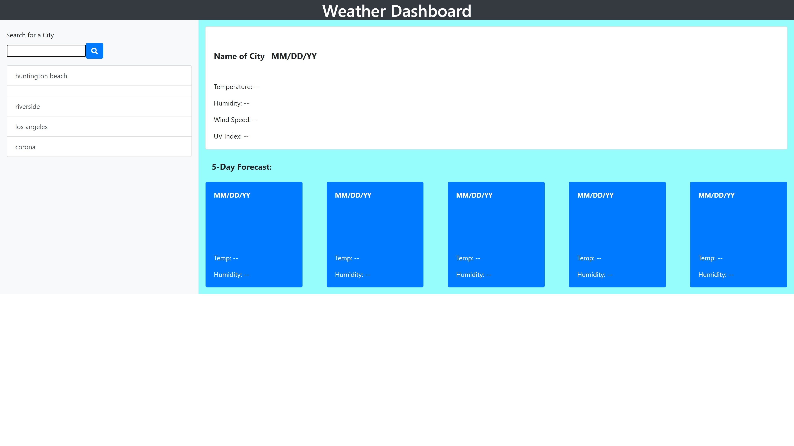

# Traveler-Forecast

An app that use a weather API to help traveler plans their trip!

## Application functionality

```
GIVEN a weather dashboard with form inputs
WHEN user search for a city
THEN user presented with current and future conditions for that city and that city is added to the search history
WHEN user view current weather conditions for that city
THEN user presented with the city name, the date, an icon representation of weather conditions, the temperature, the humidity, the wind speed, and the UV index
WHEN user view the UV index
THEN user presented with a color that indicates whether the conditions are favorable, moderate, or severe
WHEN user view future weather conditions for that city
THEN user presented with a 5-day forecast that displays the date, an icon representation of weather conditions, the temperature, the wind speed, and the humidity
WHEN user click on a city in the search history
THEN user again presented with current and future conditions for that city
```

## Live Link

- Github repository: [Traveler Weather Forecast](https://github.com/NguyenDoan85/Traveler-Forecast)
- Live link deployed: [Traveler Weather Forecast](https://nguyendoan85.github.io/Traveler-Forecast/)

## Screen shot
